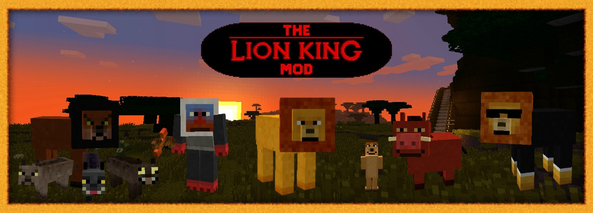

  

<h1 align="center">Circle of Craft</h1>

  <b>The Lion King meets Minecraft.</b> 
  Explore the Pride Lands, journey through the Outlands, and complete quests in an entirely new Lion King-themed adventure.

  <b>Minecraft 1.20.1</b> · <b>Forge</b>

---

## About

The Lion King Mod brings the world of Disney's The Lion King into Minecraft. It adds **three new dimensions**, dozens of animals and NPCs, unique ores, tools, armor, a full questline, custom music, and much more.

A ground-up port of the classic Lion King Mod (originally for Minecraft 1.4–1.6) to modern Minecraft.

## Features

**Dimensions**
- **Pride Lands** — a vast savannah realm with unique biomes, trees, flowers, ores, and wildlife. Fully survivable on its own.
- **Outlands** — a dark, dangerous dimension home to hyenas and other threats. Unlocked through Rafiki's quest.
- **Upendi** — a magical twilight realm.

**Mobs & NPCs**
- **Animals** — lions, lionesses, zebras, giraffes, crocodiles, bugs, and more — all breedable.
- **Hostile mobs** — hyenas, vultures, the Termite Queen boss, and more.
- **NPCs** — Rafiki, Simba, Scar, Zira, and the Ticket Lion, each with unique interactions.

**Quest system**
- **Rafiki's Quest** — multi-stage adventure. Collect hyena bones, earn Rafiki's Stick, hunt down Scar in his cave, and summon your own companion Simba who fights for you and carries your items.
- **Outlands Quest** — a full questline in the dangerous Outlands.
- **Book of Quests** — tracks progress, describes items, and shows crafting recipes.

**Content**
- New blocks — Pridestone, kingswood, mango wood, rainforest wood, passion fruit, and more.
- New items — tools, armor, food, quest items, and decorative items across multiple tool and armor tiers.
- **Grinding Bowl** — a custom crafting station for grinding items into powders.
- Dedicated creative tabs to browse everything.

**World generation**
- New biomes across the three dimensions.
- Landmark structures including the Ticket Booth and Rafiki's Tree.
- Custom ores and trees with full worldgen integration.

**Audio**
- Custom music tracks for each dimension.
- Unique mob sounds for all entities.

**Advancements**
- Custom advancements tracking your journey through the Pride Lands and beyond.

## Requirements

**Required**
- Minecraft 1.20.1
- Forge 47.4.18+
- [GeckoLib](https://www.curseforge.com/minecraft/mc-mods/geckolib) 4.8 or newer — animations for animals, NPCs, and bosses.

**Optional**
- [JEI](https://www.curseforge.com/minecraft/mc-mods/jei) 15.20 or newer — recipe lookup, including custom Grinding Bowl recipes.
- [Jade](https://www.curseforge.com/minecraft/mc-mods/jade) 11.6 or newer — HUD tooltips, including breeding-favor info on animals.

CurseForge and Modrinth will prompt for these when you install Circle of Craft through their launchers.

## Installation

1. Install [Forge for Minecraft 1.20.1](https://files.minecraftforge.net/net/minecraftforge/forge/index_1.20.1.html).
2. Install [GeckoLib](https://www.curseforge.com/minecraft/mc-mods/geckolib) (required). Optionally install JEI and/or Jade.
3. Download the latest mod JAR from [Releases](https://github.com/ron1196/circle-of-craft/releases).
4. Place the JAR in your `.minecraft/mods/` folder.
5. Launch Minecraft with the Forge profile.

## Known Limitations

- **Dart Quiver** — not available in v1; being reworked for a future release. Tracked in [issue #78](https://github.com/ron1196/circle-of-craft/issues/78).

## Screenshots

*Coming soon.*

## Credits

- **Circle of Craft** by [ron1196](https://github.com/ron1196).
- **Original mod** by [redrosewarrior1](https://www.curseforge.com/minecraft/mc-mods/the-lion-king-mod) — the classic Lion King Mod for Minecraft 1.4–1.6.

## License

GPL-3.0-or-later. See [LICENSE](LICENSE) for details.
